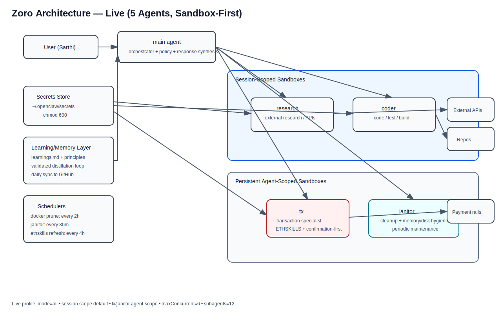

# Zoro Architecture (Public)

Latest production architecture for Zoro on OpenClaw (Raspberry Pi).

## Visual Architecture (Latest)

- Mermaid source: [`diagrams/architecture.mmd`](./diagrams/architecture.mmd)
- SVG diagram: [`diagrams/architecture.svg`](./diagrams/architecture.svg)

## What is live now
- 5-agent topology: `main`, `research`, `coder`, `tx`, `janitor`
- Sandbox-first execution (`mode=all`)
- Mixed sandbox scopes:
  - Session-scoped: research/coder
  - Agent-scoped: tx
  - Host mode (no sandbox): janitor
- High-throughput Pi profile with memory guardrails
- Periodic cleanup + skill refresh jobs

## Why this design
- Isolate risk domains
- Keep external interactions sandboxed
- Preserve performance on constrained hardware
- Make transaction path stricter than general automation

## Docs
- [`ARCHITECTURE.md`](./ARCHITECTURE.md)
- [`LEARNINGS.md`](./LEARNINGS.md)
- [`IMPLEMENTATION_CHECKLIST.md`](./IMPLEMENTATION_CHECKLIST.md)

## Extended Docs
- [`ARCHITECTURE_DEEP_DIVE.md`](./ARCHITECTURE_DEEP_DIVE.md)
- [`TRUST_BOUNDARIES.md`](./TRUST_BOUNDARIES.md)
- [`TX_GUARDRAILS.md`](./TX_GUARDRAILS.md)
- [`RUNBOOKS.md`](./RUNBOOKS.md)

- [`WORKFLOW_UPGRADES.md`](./WORKFLOW_UPGRADES.md)

- [`TECH_STACK_EXTENSIONS.md`](./TECH_STACK_EXTENSIONS.md)
